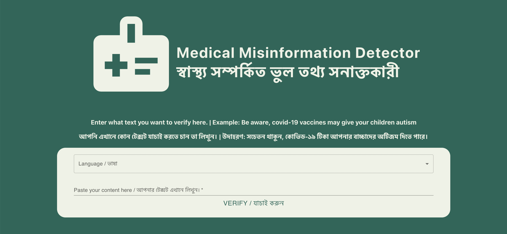

# Classifying Health Misinformation from Social Media using Machine Learning and Deep Learning Techniques in Bangladesh
The increasing use of social media provides an outlet for the dissemination of health information. However, dissemination of health information on social media may be hazardous as the information often has no regulation. Therefore, it is crucial to find ways for classifying health misinformation. 

This project utilizes Bangla text data and its English Translations to classify health misinformation from mined social media data, using machine learning models. Multiple models were used such as Naive Bayes, Ensemble learning, SVM, etc, and Deep learning models such as Transformers and LSTMs. 

The highest reported accuracy in Bangla text is 65% using LSTM while it’s 80% on the English text using ensemble learning.

# Web Application
The front end 

